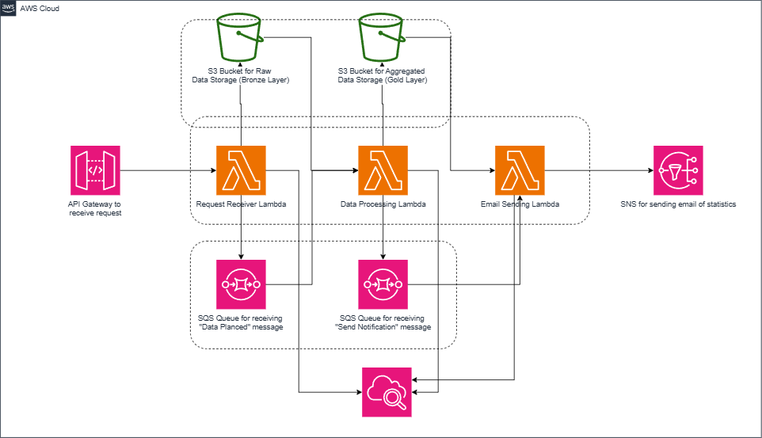

# AWS-FaaS-MQ-System

This repository contains **Terraform** and **AWS Lambda** code for a lightweight, **serverless event-driven system** developed as part of my **TAship for CS-487 (Cloud Development)**. The project was an exciting opportunity to implement a **decoupled architecture** that calculates quiz statistics using **AWS Lambda, API Gateway, S3, SQS, and SNS**.

## 📌 Project Overview  

This system processes quiz statistics **asynchronously** using AWS services. It **ingests quiz data via an API**, stores it in S3, and triggers a sequence of Lambda functions via **SQS message queues** to compute statistics and notify users.



## 🛠️ Expected Workflow  

1. **API Gateway**  
   - Exposes the **Request-Receiver-Lambda** to the internet.  
   - Authentication is set to `"NONE"` for now, but in production, AWS Cognito can be used for secure access.  

2. **Request-Receiver-Lambda**  
   - Receives **CSV data** via an API request (see example below).  
   - Stores the data as a CSV file in an **S3 bucket** (e.g., `raw-data-bucket`).  
   - Places a **message in SQS Queue 1** to notify the next process.  
   - (For large file uploads, multipart upload can be implemented.)  

3. **SQS Queue 1**  
   - Receives messages from **Request-Receiver-Lambda**.  
   - Triggers **Analytics-Calculator-Lambda**.  

4. **Analytics-Calculator-Lambda**  
   - Retrieves the CSV file from S3.  
   - Parses the data and **calculates statistics** (min, max, mean scores).  
   - Stores the computed statistics in another **S3 bucket**.  
   - Sends a message to **SQS Queue 2**.  
   - (More advanced versions could include data transformations and quality checks.)  

5. **SQS Queue 2**  
   - Triggers **Result-Notifier-Lambda**.  

6. **Result-Notifier-Lambda**  
   - Retrieves the statistics file from the second **S3 bucket**.  
   - Sends an **email notification** with quiz statistics via **SNS**.  
   - (Future improvements could integrate this with external reporting systems.)  

## 🔥 API Example  

Use **Postman** or `curl` to send a POST request to the API Gateway:  

```sh
curl -X POST "<Your_API_Endpoint>" \
-H "Content-Type: application/json" \
-d '{
  "data": [
    "Quiz1,85,76,90",
    "Quiz2,78,88,85",
    "Quiz3,92,90,87"
  ]
}'
